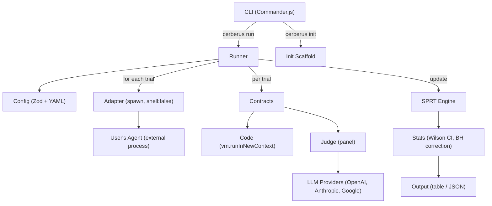

# Cerberus MVP — Statistical CI/CD for AI Agents

## Overview

Build a TypeScript CLI that brings statistical rigor to non-deterministic AI agent testing. Run an agent N times, evaluate contracts, use SPRT for adaptive early stopping, display results with confidence intervals, and exit with CI-appropriate codes.

```bash
$ cerberus run
Running study: standard-review (max 50 trials)
  ████████████░░░░░░░░  24/50  SPRT: continuing

Contracts:
  no-false-positives      PASS  100.0% [CI: 93–100%]  (12 trials, early stop)
  catches-security-issues PASS   94.0% [CI: 90–97%]   (50 trials)
  follows-style-guide     PASS   88.0% [CI: 84–92%]   (50 trials)

Suite: PASS (3/3 contracts satisfied)
```

## Problem Statement

Every AI agent evaluation tool (promptfoo, Braintrust, DeepEval, Inspect AI) treats non-deterministic outputs as deterministic — running each test once and comparing to an expected answer. This is fundamentally wrong for stochastic agents. Cerberus treats every evaluation as a statistical experiment.

## Design Decisions

### D1: Adapter Output Contract

The agent process MUST write valid JSON to stdout. Non-JSON stdout is captured as fallback.

```typescript
interface TrialMeta {
  readonly raw: string;       // raw stdout (always available)
  readonly stderr: string;    // stderr capture
  readonly exitCode: number;  // process exit code
  readonly durationMs: number; // wall-clock ms
  readonly jsonParsed: boolean;
}

interface TrialOutput {
  readonly meta: TrialMeta;
  readonly parsed: Readonly<Record<string, unknown>>; // user's JSON fields
}
```

Contract expressions access `output.parsed.suggestions` (explicit separation of system metadata from user data). This avoids the TypeScript index signature bug where `[key: string]: unknown` widens all properties to `unknown`.

### D2: Scenario File Format

YAML with a required `input` field and optional metadata. Single-turn only for MVP.

```yaml
# scenarios/standard-pr.yaml
input: |
  Review this pull request for security issues:
  ```python
  def login(username, password):
      query = f"SELECT * FROM users WHERE name='{username}' AND pass='{password}'"
      return db.execute(query)
  ```
metadata:
  category: security
```

### D3: Template Expansion

`{{scenario}}` in the adapter command is replaced with a temp JSON file path. The command template is parsed into `[executable, ...args]` at config load time and executed with `spawn(executable, args, { shell: false })` to prevent command injection.

```yaml
command: "node ./agent.js --scenario {{scenario}}"
# Parsed at config time -> executable: "node", args: ["./agent.js", "--scenario", "{{scenario}}"]
# At runtime -> spawn("node", ["./agent.js", "--scenario", "/tmp/cerberus-abc/scenario.json"])
```

### D4: SPRT Parameter Mapping

| YAML field | SPRT parameter | Description |
|---|---|---|
| `threshold` | p0 (null hypothesis) | "I expect at least this pass rate" |
| — | p1 = max(0.01, threshold - 0.10) | Alternative hypothesis (10% degradation) |
| `confidence` | 1 - alpha | Confidence level for Type I error |
| — | beta = 0.20 (fixed) | Type II error rate (power = 0.80) |

The `trials` field is the **maximum**. SPRT stops early when evidence is sufficient. Config-time check: reject `threshold < 0.11` (p1 would be degenerate).

### D5: Judge Credentials

Environment variables. Model identifier in YAML, provider inferred from name prefix.

```yaml
judges:
  - model: gpt-4o           # requires OPENAI_API_KEY
  - model: claude-sonnet-4-5-20250929  # requires ANTHROPIC_API_KEY
  - model: gemini-2.0-flash # requires GOOGLE_API_KEY
```

### D6: Trial Failure Handling

Crashed/timed-out trials count as failures for all contracts. If >20% crash (configurable `max_error_rate`), the study aborts.

### D7: Exit Codes

| Code | Meaning |
|---|---|
| 0 | Suite passed |
| 1 | Suite failed |
| 2 | Configuration error |
| 3 | Inconclusive (SPRT didn't converge) |
| 4 | Runtime error |

### D8: Contract Types

Two types, not three. "Semantic" and "behavioral" are the same thing with different panel sizes.

```yaml
contracts:
  - name: no-false-positives
    type: code                                    # evaluated via vm.runInNewContext()
    assert: "output.parsed.suggestions.every(s => s.file_exists)"

  - name: catches-security-issues
    type: judge                                   # single judge (default panel: 1)
    rubric: "The review identifies the SQL injection vulnerability"
    threshold: 0.90
    confidence: 0.95

  - name: follows-style-guide
    type: judge
    judge_panel: 3                                # panel of 3 judges, majority vote
    source: ./CLAUDE.md#style-rules               # optional context file
    rubric: "Agent follows the style guide rules"
    threshold: 0.85
    confidence: 0.99
```

### D9: Assertion Sandboxing

Code contracts use `vm.runInNewContext()` with a restricted sandbox (frozen globals, 100ms timeout). **NOT `new Function()`** — that allows arbitrary code execution including `require('child_process')`.

```typescript
import { runInNewContext } from "node:vm";

function evaluateAssertion(expr: string, output: TrialOutput, scenario: Scenario): boolean {
  const sandbox = Object.freeze({
    output: Object.freeze(output),
    scenario: Object.freeze(scenario),
    Math: Object.freeze(Math),
    Array, String, RegExp, Boolean, Number, JSON: Object.freeze(JSON),
  });
  const result: unknown = runInNewContext(`"use strict"; (${expr})`, sandbox, { timeout: 100 });
  return Boolean(result);
}
```

---

## Technology Stack

| Component | Choice |
|---|---|
| Language | TypeScript 5.7+ (ESM, strict) |
| Runtime | Node.js 20+ LTS |
| CLI framework | Commander.js 14.x |
| Config validation | Zod 4.x |
| YAML parsing | yaml 2.x |
| Bundler | tsup 8.x |
| Tests | Vitest 4.x |
| Terminal colors | picocolors 1.x |

**4 runtime deps.** No cli-table3 (manual alignment), no ora (simple spinner), no simple-statistics (Wilson CI is 15 lines, SPRT is hand-rolled).

---

## Project Structure

```
cerberus/
├── src/
│   ├── cli.ts                # Entry point + Commander commands
│   ├── config.ts             # Zod schemas + YAML loader
│   ├── stats.ts              # SPRT + Wilson CI + BH/Bonferroni correction
│   ├── runner.ts             # Study/trial orchestration + adapter (spawn + capture)
│   ├── contracts.ts          # Code eval (vm sandbox) + judge delegation
│   ├── judges.ts             # All 3 providers + panel aggregation + prompt template
│   ├── output.ts             # Table, JSON, progress, formatting
│   ├── errors.ts             # CerberusError + ConfigError (2 classes total)
│   └── types.ts              # Shared type definitions
├── tests/
│   ├── stats.test.ts
│   ├── config.test.ts
│   ├── runner.test.ts
│   ├── contracts.test.ts
│   ├── judges.test.ts
│   └── fixtures/
│       ├── agents/           # Real scripts: echo.js, crash.js, slow.js
│       ├── valid-config.yaml
│       ├── invalid-config.yaml
│       └── scenarios/
│           └── simple.yaml
├── tsup.config.ts
├── tsconfig.json
├── vitest.config.ts
├── package.json
├── .gitignore
├── CLAUDE.md
└── README.md
```

**9 source files.** Types live next to the code that uses them, except shared types in `types.ts`. No `types.ts` per directory. No dispatcher interface — a `switch` in `contracts.ts` handles routing.

---

## Architecture



---

## Implementation Phases

### Phase 1: Foundation + Stats Engine

**Goal:** Working project with config loading, SPRT, and Wilson CIs. `cerberus --help` works.

**Create:**
- `package.json`, `tsconfig.json`, `tsup.config.ts`, `vitest.config.ts`, `.gitignore`, `CLAUDE.md`
- `src/types.ts` — TrialMeta, TrialOutput, TrialResult, StudyResult, ContractVerdict, SuiteResult
- `src/errors.ts` — CerberusError (base with exit code), ConfigError (extends, exit 2)
- `src/config.ts` — Zod schemas + YAML loader. Schemas: AdapterSchema, ContractSchema (discriminated by `type: "code" | "judge"`), StudySchema, CerberusConfigSchema. Parse command template into [executable, ...args] at load time. Validate threshold >= 0.11, confidence in [0.50, 0.999]. Export inferred types via `z.infer<>`.
- `src/stats.ts` — `createSPRT()`, `updateSPRT()` (immutable, readonly state, NaN guards), `sprtConfigFromContract()`, `wilsonScoreInterval()`, `benjaminiHochbergCorrection()`, `bonferroniCorrection()`
- `src/cli.ts` — Commander skeleton: `run` and `init` subcommands (stubs)
- `tests/config.test.ts` — valid config, invalid config, missing fields, threshold edge cases
- `tests/stats.test.ts` — SPRT convergence (100% pass, 0% pass, borderline), Wilson CI reference values (45/50 at 95%), BH vs Bonferroni behavior
- Test fixtures: `valid-config.yaml`, `invalid-config.yaml`, `scenarios/simple.yaml`

**Verify:** `npm test` passes, `npm run build` produces `dist/cli.js`, `node dist/cli.js --help` works.

---

### Phase 2: Execution Engine + Contracts

**Goal:** `cerberus run` works end-to-end with code contracts (no LLM judges yet).

**Create:**
- `src/runner.ts` — Scenario loading (YAML -> temp JSON file), CLI adapter (`spawn` with `shell: false`, stdout capture with 1MB size limit, timeout handling with SIGTERM->5s->SIGKILL, JSON parse with `meta.raw` fallback), study/trial loop with SPRT per contract, early stop when all contracts decided, `max_error_rate` abort.
- `src/contracts.ts` — `evaluateContract()` dispatcher (switch on type). Code contracts: `vm.runInNewContext()` with frozen sandbox, 100ms timeout, max 10K char expression. Judge contracts: stub that throws "judges not implemented" (Phase 3).
- `src/output.ts` — CI detection (`process.env.CI`), result table (manual alignment with picocolors), progress (TTY: spinner + count, CI: line logging), JSON output serialization.
- Wire `cerberus run` in `src/cli.ts` — load config, run suite, display results, exit with code.
- `tests/runner.test.ts` — with real fixture scripts (echo.js, crash.js, slow.js), timeout test, non-JSON output test
- `tests/contracts.test.ts` — expression eval, runtime error handling, sandbox escape attempts
- Fixture scripts: `tests/fixtures/agents/echo.js`, `crash.js`, `slow.js`

**Verify:** `cerberus run` with a code-only config executes trials, evaluates contracts, displays results, exits with correct code. `cerberus run --json` outputs valid JSON.

---

### Phase 3: Judge Panel System

**Goal:** Judge-based contracts work with real LLM providers.

**Create:**
- `src/judges.ts` — All in one file:
  - **Prompt template:** rubric -> agent output (truncated to 10KB) -> structured JSON response format. Randomize presentation order.
  - **3 provider functions:** `callOpenAI()`, `callAnthropic()`, `callGoogle()`. Each: check env var, construct request with `fetch()`, Zod-validate response (no `as any`), 60s timeout with AbortController, retry once with backoff on 429.
  - **Provider registry:** Map model prefix -> provider function. List available providers (those with API keys).
  - **Panel:** Invoke all judges in parallel. Handle partial failure (retry once, skip). Require >= 1 judge success. Majority vote. Average confidence.
  - **Verdict parsing:** Multi-strategy JSON extraction (raw parse, code block, brace matching). Zod schema for verdict. Normalize case/boolean variants.
- Wire judge contracts in `contracts.ts` — delegate to `evaluateWithPanel()`.
- `tests/judges.test.ts` — mock provider functions (inject fakes), test majority vote, partial failure, all fail -> error, prompt template verification

**Verify:** `cerberus run` with judge contracts invokes LLM APIs, aggregates verdicts, produces correct results. Works with 1 judge and 3-judge panels.

---

### Phase 4: Polish + E2E

**Goal:** `cerberus init`, result persistence, documentation, end-to-end tests.

**Create:**
- `cerberus init` in `src/cli.ts` — scaffold `cerberus.yaml` + `scenarios/` with example
- Result persistence — write results to `.cerberus/runs/<timestamp>.json` after each run
- `README.md` — installation, quick start, config reference, CI integration (GitHub Actions example)
- E2E tests: happy path (all pass), failure path, SPRT early stop, timeout, crash/error-rate, inconclusive, JSON output, all 5 exit codes
- Fixture: `tests/fixtures/agents/flaky.js` (fails ~20% of the time)

**Verify:** All E2E tests pass. `npm pack` creates installable package. Fresh `npx cerberus init && cerberus run` works.

---

## Acceptance Criteria

### Functional
- [ ] `cerberus init` scaffolds valid config + scenario
- [ ] `cerberus run` loads config, runs trials via CLI adapter, evaluates contracts, displays results
- [ ] SPRT stops early when evidence is sufficient
- [ ] Wilson score CIs for all contract pass rates
- [ ] Code contracts evaluate expressions via `vm.runInNewContext()` sandbox
- [ ] Judge contracts invoke 1-N LLM judges and aggregate by majority vote
- [ ] `cerberus run --json` outputs structured JSON to stdout
- [ ] Exit codes: 0 (pass), 1 (fail), 2 (config error), 3 (inconclusive), 4 (runtime error)
- [ ] BH correction applied by default across contracts in a suite
- [ ] Agent stdout capped at 1MB; adapter uses `spawn` with `shell: false`

### Non-Functional
- [ ] CLI startup < 200ms (lazy imports)
- [ ] Zero crashes from malformed agent output
- [ ] Works in CI (no TTY dependency)
- [ ] TypeScript strict mode, no `any` in source

### Quality Gates
- [ ] Unit tests for stats, contracts, judges (>80% coverage)
- [ ] E2E tests for all 5 exit code scenarios
- [ ] `npm run typecheck` passes with zero errors

---

## Risk Analysis

| Risk | Impact | Mitigation |
|---|---|---|
| Assertion sandbox escape via `vm.runInNewContext()` | High | Frozen sandbox, 100ms timeout, restricted globals. Document that vm is not escape-proof. |
| Command injection via adapter template | High | Parse template at config time; `spawn` with `shell: false`. |
| SPRT parameter mapping edge cases | High | Unit tests against R's `SPRT` reference values. Reject threshold < 0.11. |
| Judge prompt injection from agent output | Medium | Truncate output to 10KB in judge prompts. Structural separation. |
| LLM judge calls are expensive/slow | Medium | SPRT early stopping. Code contracts are free. |

---

## Future Considerations (Post-MVP)

- SIGINT handling with partial results (exit code 5)
- `cerberus validate` and `cerberus schema` commands
- Programmatic API exports (`src/index.ts`)
- `--inconclusive-as pass|fail` flag for CI
- Circuit breaker for judge providers
- Cost estimation / `--max-cost` flag
- Judge panel quorum enforcement (`min_quorum`)
- Trial concurrency (`concurrency: N`)
- Checkpointing and resume for long runs
- Config composition (`!include`)
- Prompt mutation testing
- Contract coverage (% of CLAUDE.md rules with contracts)
- Minimal violation scenarios (QuickCheck-style shrinking)
- Level 3: Adversarial contracts (red-team, prompt injection resilience)
- Web dashboard

---

## References

- **Brainstorm:** `docs/brainstorms/2026-02-06-cerberus-brainstorm.md`
- **Deepened plan (archived):** `docs/plans/2026-02-09-feat-cerberus-mvp-statistical-ci-cd-plan-deepened.md`
- **Scale game analysis:** `docs/plans/2026-02-09-scale-game-analysis.md`
- [SPRT](https://en.wikipedia.org/wiki/Sequential_probability_ratio_test) | [Wilson Score](https://en.wikipedia.org/wiki/Binomial_proportion_confidence_interval#Wilson_score_interval) | [Benjamini-Hochberg](https://en.wikipedia.org/wiki/False_discovery_rate#Benjamini%E2%80%93Hochberg_procedure)
- [Commander.js](https://github.com/tj/commander.js) | [Zod](https://zod.dev/) | [tsup](https://tsup.egoist.dev/) | [Vitest](https://vitest.dev/)
