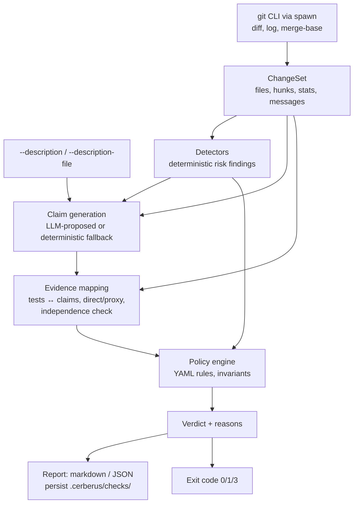
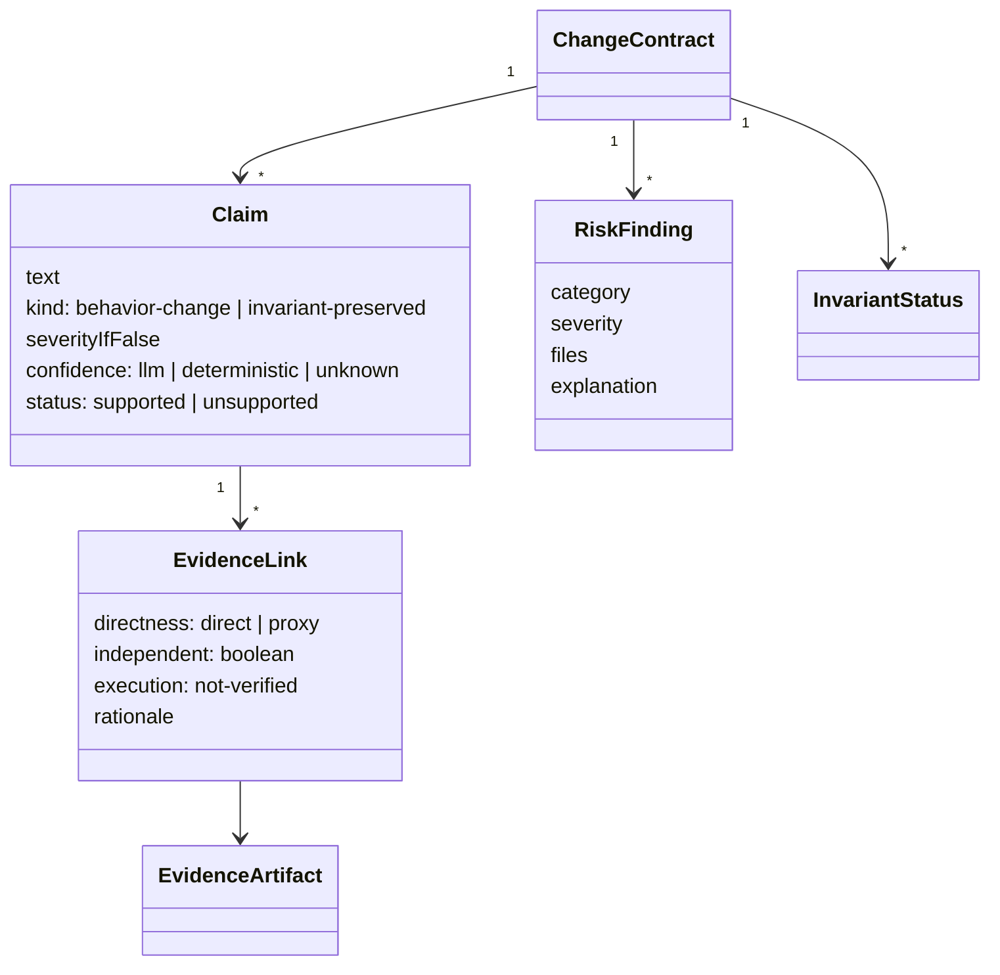

# feat: Proof-Carrying Changes MVP — `cerberus check`

## Summary

Build the Proof-Carrying Changes analysis engine as a new `cerberus check` subcommand. Given a git ref range and an optional task description, it produces a Change Contract — LLM-proposed behavioral claims, deterministic risk findings, claim-to-test evidence mapping, and a policy verdict (`pass` / `pass-with-warnings` / `needs-evidence` / `split-required` / `block`) — rendered as a compact report with semantic exit codes, runnable locally and in GitHub Actions advisory mode.

## Problem Frame

The PRD (see origin: `docs/prds/proof-carrying-changes-prd.md`) identifies the bottleneck: AI agents generate more code than senior reviewers can confidently verify, and no existing tool answers "does this change carry enough evidence to justify the behavioral claims it makes?" The PRD's rollout plan starts with advisory-mode PR analysis (Phase 0–1). This plan builds the smallest artifact that validates that thesis: the analysis engine itself, shipped inside Cerberus, whose existing identity (statistical CI/CD for AI agents, semantic exit codes, LLM-provider clients, spawn-based process handling) is the natural host for a change-assurance command.

---

## Assumptions

Decisions made autonomously in pipeline mode; each is revisable without invalidating the rest of the plan.

- **Engine wedge, not SaaS shell.** The GitHub App, hosted repository indexer, outcome tracker, and team dashboard (PRD §15.1) are out of scope. The wedge is a CLI + GitHub Actions advisory check — PRD open question 1 resolved as "start at PR time," open question 12 resolved as "lead with the four critical risk categories."
- **Built inside the Cerberus repo** as a subcommand and `src/pcc/` subsystem, reusing the existing CLI, provider clients, config patterns, and conventions (no new runtime dependencies).
- **Heuristic detectors, not AST analysis.** Risk detection uses path and diff-content heuristics tuned for TypeScript/JavaScript and Python conventions. Language-specific analyzers (PRD §15.1) are deferred.
- **Local persistence only.** Results go to `.cerberus/checks/`, mirroring the existing `.cerberus/runs/` pattern. No evidence store service.
- **PR description arrives via flag or file**, not the GitHub API. CI callers pass `--description-file` (e.g., from the event payload); there is no GitHub App to fetch it.

---

## Requirements

**Change Contract generation** (PRD §7.1, §8.2)

- R1. `cerberus check [range]` analyzes a git ref range (default: merge-base of HEAD and the base branch) and produces a Change Contract: claims, risk findings, affected invariants, evidence status, rollback status, and a verdict.
- R2. Claims are falsifiable statements that distinguish intended behavior changes from preserved invariants; when intent cannot be inferred, the contract marks it `intent unknown` rather than fabricating (PRD §11.5).
- R3. Claim generation degrades deterministically: with an LLM API key, claims are LLM-proposed; without one (or with `--no-llm`), the contract is built from detector findings and marked uncertain. An LLM statement is never the sole basis for a passing verdict (PRD §15.2).

**Risk detection** (PRD §8.5, §18.5)

- R4. Deterministic detectors identify, at minimum: permission/auth changes, schema/migration changes (with destructive-vs-additive severity), public API surface changes, unrelated bundled changes, test deletions/weakened assertions, and dependency/infrastructure changes.

**Evidence mapping** (PRD §8.3, §9.2)

- R5. Tests added or modified in the change are mapped to claims; every mapping is labeled `direct` or `proxy`, cites the concrete test artifact, and claims with no evidence are flagged. Mappings that reference tests not present in the head tree are rejected.
- R6. Implementation-and-expectation co-modification is detected: when a claim's evidence comes from a test whose assertions were rewritten in the same change as the implementation, the evidence is flagged as non-independent (PRD §16.5).

**Data handling and safety** (PRD §15.3, §16.1)

- R14. Diff content passes a secret-redaction pass before any LLM prompt; a data-minimization mode sends only per-file stats and detector findings (no raw hunks); detected secrets surface as risk findings even in `--no-llm` mode; the docs state each provider's data-use posture.

**Policy and verdicts** (PRD §8.6, §9.1)

- R7. Policy is a version-controlled YAML file (Zod-validated, repo-specific, with a shipped default); evaluation is deterministic and every verdict carries explainable reasons citing rule and finding.
- R8. The verdict is exactly one of `pass`, `pass-with-warnings`, `needs-evidence`, `split-required`, `block`, mapped to semantic exit codes; `--advisory` forces exit 0 for everything except config and runtime errors.
- R13. Policy may declare repository invariants (name, description, matching paths, required evidence, severity); a change touching an invariant's paths marks it affected and drives `needs-evidence` when required evidence is absent (PRD §7.4, §16.6).
- R16. A reviewer can override a non-pass verdict via `--override "<owner>: <rationale>"`: the exit code clamps to 0 and the owner, rationale, and overridden verdict are recorded in the persisted result and report (PRD §11.6, §18 #7).

**Output and integration** (PRD §8.7)

- R9. The report renders in the GitHub Check order — verdict, highest-risk unsupported claims, claims with evidence status, affected invariants, split recommendation, rollback status, evidence details — as markdown for humans and `--json` for machines. stdout carries only report content; progress goes to stderr.
- R10. Every check result is persisted to `.cerberus/checks/<timestamp>.json`.
- R11. A documented GitHub Actions workflow runs `cerberus check` on pull requests in advisory mode, passes the PR description via `--description-file`, surfaces the markdown report in the job summary, and documents an optional sticky PR comment step.

**Measurement** (PRD §17 Phase 0)

- R15. A replay mode runs the analysis over historical commit ranges in batch and aggregates verdicts and finding categories from the persisted results, so policy tuning and false-positive measurement are possible the day the engine ships.

**Conventions**

- R12. The subsystem preserves repo contracts: 4 runtime deps (no additions), TypeScript strict/ESM, no `any`, `node:` import prefixes, `spawn()` with `shell: false`, `readonly` interface fields, tests in `tests/`.

---

## Key Technical Decisions

- **Subcommand in Cerberus, not a new package:** `cerberus check` ships in the existing binary. Reuses commander wiring, `EXIT_CODE`, picocolors output, and Zod/YAML config patterns; one install for users. The PCC subsystem lives in `src/pcc/` to keep the existing study-runner code untouched.
- **Deterministic core, LLM assist:** detectors, evidence verification, and policy evaluation are pure functions of the ChangeSet and never require network. The LLM proposes claims and refines evidence mapping; deterministic checks validate everything it proposes (PRD §15.2). This also makes the full pipeline testable offline.
- **Git data via the `git` CLI through `spawn(..., { shell: false })`**, not a git library — preserves the 4-dependency constraint and mirrors the existing adapter pattern in `src/runner.ts`.
- **Shared LLM provider module:** extract `callOpenAI`/`callAnthropic`/`callGoogle`/`getProvider` from `src/judges.ts` into `src/providers.ts` so claim generation and judge panels share one client layer instead of duplicating fetch code.
- **Exit-code mapping reuses existing semantics:** `pass`/`pass-with-warnings` → 0, `block` → 1, config error → 2, `needs-evidence`/`split-required` → 3 (actionable, not failure — same spirit as the existing inconclusive code), runtime error → 4.
- **Default policy is advisory-first (PRD Phase 1 posture):** the shipped default carries three narrow block rules — destructive migrations without rollback, permission changes without auth-test evidence, critical claims without qualifying evidence — as `false` toggles that only warn until a repo policy flips them on. Exit 1 therefore requires explicit opt-in, matching the PRD rollout order and its over-blocking risk (§16.2). When enabled, the permission block rule fires only on high-confidence path-based permission findings; keyword-only hunk matches stay warning-level and can never block.
- **Statically mapped evidence never masquerades as proof:** every MVP evidence link is labeled `statically mapped — execution not verified` in report and JSON; block-level rules accept a mapped test only when it exists in the head tree, is not skip-marked, and is independent (R6). CI-results ingestion (deferred) later upgrades links to executed status (PRD §11.7, §16.1).
- **Rollback status is heuristic in MVP:** detected from migration-reversal files and rollback/revert language in the description; absence on a migration-bearing change is a finding, not a guess.

---

## High-Level Technical Design

Pipeline shape — every stage is a pure transformation; only claim generation (optionally) touches the network:



Core objects (directional; field lists in PRD §7 govern):



Policy file shape (directional sketch, not implementation specification):

```yaml
# pcc-policy.yaml
version: 1
thresholds:
  max_unrelated_clusters: 2        # above this -> split-required
rules:
  # advisory-first defaults — flip on after replay tuning
  block_destructive_migration_without_rollback: false
  block_permission_change_without_auth_test: false
  block_critical_claim_without_direct_evidence: false
invariants:
  - name: tenant-scoping
    description: Tenant-scoped queries include a tenant identifier
    paths: ["src/db/**"]
    requires_evidence: true
    severity: critical
```

---

## Implementation Units

### U1. PRD import and PCC domain types

- **Goal:** Establish the domain vocabulary and carry the PRD into the repo as the origin artifact.
- **Requirements:** foundation for all; R12.
- **Dependencies:** none.
- **Files:** `docs/prds/proof-carrying-changes-prd.md` (imported), `src/pcc/types.ts`.
- **Approach:** Pure type definitions mirroring PRD §7: `ChangeSet`/`FileChange` (status, path, oldPath, hunks, additions, deletions, isTest, isBinary), `Claim`, `EvidenceArtifact`, `EvidenceLink`, `RiskFinding` (category union covering R4), `InvariantStatus`, `Verdict` union, `CheckResult`. All fields `readonly`, following `src/types.ts` style. No Zod here — schemas live beside their consumers (claims parsing in U5, policy in U7), matching the `judges.ts` precedent.
- **Test scenarios:** Test expectation: none — type-only unit plus a document copy; `npm run typecheck` is the check.
- **Verification:** typecheck passes; PRD file present and referenced by plan frontmatter.

### U2. Git change collection

- **Goal:** Turn a ref range into a complete, typed `ChangeSet` with zero shell interpolation.
- **Requirements:** R1, R12.
- **Dependencies:** U1.
- **Files:** `src/pcc/git.ts`, `tests/pcc/git.test.ts`.
- **Approach:** A small `runGit(args, cwd)` helper wrapping `spawn("git", args, { shell: false })` with captured stdout/stderr and non-zero-exit errors mapped to `CerberusError` (exit 4; unresolvable refs/not-a-repo → exit 2). Base resolution order: `--base` flag > `origin/HEAD` > remote-tracking `origin/main`/`origin/master` > local `main`/`master` (CI checkouts often have remote-tracking refs but neither `origin/HEAD` nor a local default branch). Every user-supplied range — two-dot, three-dot, or single ref — is normalized to `merge-base(base, head)..head` before invoking `git diff` and `git log`, so endpoint-diff semantics never leak upstream commits into findings or the claim prompt. Collect: `git merge-base`, `git diff --name-status -M` for statuses and renames, `--numstat` for sizes and binary detection, per-file `-U0` patches for content heuristics, and `git log` subject lines for the normalized range. A zero-file ChangeSet is valid output: downstream (U8) short-circuits it to verdict `pass` with an explicit "no changes analyzed for range X" note and exit 0, never a silent green. Task description comes from `--description`/`--description-file`. Test-file classification (`*.test.*`, `*.spec.*`, `_test.py`, `test_*.py`, `tests/`, `__tests__/`) computed here once so detectors and evidence mapping share it.
- **Patterns to follow:** `executeTrial()` in `src/runner.ts` for spawn/capture; error classes in `src/errors.ts`.
- **Test scenarios:** Build throwaway repos with `git init --initial-branch=main` in `mkdtemp` dirs (deterministic across `init.defaultBranch` configs; same real-process philosophy as `tests/runner.test.ts`):
  - Added, modified, and deleted files each appear with correct status and counts.
  - A rename is reported as a rename (with `oldPath`), not delete+add.
  - Binary file (numstat `-`) sets `isBinary` and carries no hunks.
  - Any supplied dot-form (`base..head`, `base...head`, bare ref) normalizes to merge-base semantics: a feature branch behind a base that contains a destructive migration upstream produces a ChangeSet with no upstream files in it.
  - Default base resolves via remote-tracking `origin/main` when `origin/HEAD` and local `main` are both absent; falls back to local `main` when no remote exists.
  - A range with zero changed files yields an empty ChangeSet (not an error).
  - Running outside a git repo (or with an unknown ref) throws `ConfigError`-style exit-2 errors with actionable messages.
  - `test_utils.py` and `foo.test.ts` are classified as tests; `contest.ts` is not.
- **Verification:** unit tests pass against real temp repos on macOS/Linux CI.

### U3. Deterministic risk detectors

- **Goal:** Produce the PRD's critical-category risk findings from a `ChangeSet` alone.
- **Requirements:** R4, R14 (secret findings).
- **Dependencies:** U1, U2.
- **Files:** `src/pcc/detectors.ts`, `tests/pcc/detectors.test.ts`.
- **Approach:** One pure function per category, composed by `detectRisks(changeSet): RiskFinding[]`. Heuristics:
  - *Migration/schema:* paths (`migrations/`, `*.sql`, `schema.prisma`, `alembic/`, `db/migrate/`) and hunk content (`ALTER TABLE`, `DROP TABLE|COLUMN`, `TRUNCATE`); destructive statements or deleted migration files escalate severity to critical, additive stays warning-level. Presence/absence of a reversal artifact (down-migration file, `rollback`/`revert` in description) sets rollback status.
  - *Auth/permission:* two confidence levels. High-confidence: changed files under auth-signaling path segments (`auth/`, `permissions/`, `acl/`, `guards/`) or hunks modifying role/permission-check logic. Low-confidence: identifier keywords in changed hunks (`auth`, `permission`, `role`, `acl`, `guard`, `scope`, `session`, `token`, `middleware`) with word-boundary matching to avoid `author`-style false hits. The finding carries its confidence level; only high-confidence findings can feed block rules (U7).
  - *Committed secrets:* high-confidence secret patterns in added lines (AWS access key IDs, private-key headers, literal bearer/token assignments) → critical finding, independent of any LLM (R14).
  - *Public API:* changed/removed `export` declarations in TS hunks, route registrations (`app.get(`, `router.`, `@app.route`, `urls.py`), `package.json` `exports`/`main`/`bin`, and `openapi`/`*.graphql` files.
  - *Dependencies/infra:* manifest and lockfile diffs (`package.json` dep sections, `requirements.txt`, `pyproject.toml`); `Dockerfile`, `.github/workflows/`, terraform/k8s paths.
  - *Test integrity:* deleted test files; modified tests whose removed `expect(`/`assert` lines exceed added ones (weakened assertions); added skip markers (`.skip`, `xit`, `@pytest.mark.skip`).
  - *Unrelated-change clustering:* group non-test changed files by the first path segment below recognized source roots (`src/`, `lib/`, `packages/`, `apps/`) and by top-level directory otherwise, so `src/billing/` and `src/search/` form distinct clusters (with a light same-basename/import-token affinity merge); N clusters above the policy threshold, each non-trivial, yields a split-recommendation finding listing the clusters.
- **Test scenarios:** crafted `ChangeSet` literals per category:
  - `DROP COLUMN` in `migrations/002.sql` → migration finding, severity critical, rollback undetected.
  - Additive `CREATE TABLE` plus a matching down-migration → warning severity, rollback detected.
  - Hunk touching `requireRole(` in `src/auth/guard.ts` → permission finding at high confidence; a hunk mentioning `token` in `src/http/client.ts` → permission finding at low confidence; a diff containing only the word `author` → no permission finding.
  - Added line matching an AWS access key ID pattern → critical secret finding; a random hex string → none.
  - Removed `export function` line → public-API finding; internal-only edit → none.
  - Deleted `tests/foo.test.ts` → test-integrity finding; test file with 5 removed and 1 added `expect` → weakened-assertion finding; balanced rewrite → none.
  - Changes spread across `src/billing/`, `src/search/`, and `docs/` → clustering finding with 3 clusters; changes confined to `packages/billing/` in a monorepo → none; single-directory change → none.
- **Verification:** all detector tests pass; each finding carries category, severity, files, and a human-readable explanation.

### U4. Shared LLM provider module

- **Goal:** One provider client layer for judges and claim generation.
- **Requirements:** R3 (enables), R12.
- **Dependencies:** none (parallel-safe; U5 consumes it).
- **Files:** `src/providers.ts`, `src/judges.ts`, `tests/judges.test.ts`.
- **Approach:** Move `callOpenAI`, `callAnthropic`, `callGoogle`, `getProvider`, `getEnvVar`, and the shared timeout constant from `src/judges.ts` to `src/providers.ts` verbatim; `judges.ts` imports them and keeps its public surface (including `_getProvider` test export) unchanged. No behavior change.
- **Execution note:** pure refactor — run the full existing suite before and after; any diff in test results is a defect.
- **Test scenarios:** existing `tests/judges.test.ts` provider-routing tests pass unmodified; add one test importing routing directly from `src/providers.ts` (e.g., `claude-*` → anthropic) to pin the new module's surface.
- **Verification:** `npm test` and `npm run typecheck` green with no test edits beyond the added import test.

### U5. Claim generation

- **Goal:** Produce falsifiable claims from the change — LLM-proposed when possible, honestly degraded when not — without leaking secrets or unnecessary source to providers.
- **Requirements:** R2, R3, R14.
- **Dependencies:** U1, U2, U3, U4.
- **Files:** `src/pcc/claims.ts`, `tests/pcc/claims.test.ts`.
- **Approach:** `generateClaims(changeSet, findings, options)` with two paths:
  - *LLM path* (an API key for the selected model exists and `--no-llm` absent): build a prompt from the task description, commit subjects, a truncated diff digest (per-file stats plus capped hunk excerpts, ~10K chars total like the judge prompt cap), and detector findings; request a strict JSON array of claims (text, kind, components, severity-if-false, suggested evidence). Before any content enters the prompt, a redaction pass replaces high-confidence secret matches (same patterns as U3's secret detector) with `[REDACTED]`. `--llm-content minimal` sends only per-file stats and detector findings — no raw hunks — as the data-minimization middle ground between full excerpts and `--no-llm` (R14); the docs state each provider's data-use posture. Parse with a Zod schema via the multi-strategy extraction pattern proven in `parseVerdict()` (direct parse → fenced block → brace match); retry-once semantics from `callJudgeWithRetry`. Model selected by `--model` (default a `claude-*` model), routed through `src/providers.ts`. Every LLM claim carries `confidence: "llm"`.
  - *Deterministic fallback:* one claim per detector finding (`invariant-preserved` kind for untouched invariants, `behavior-change` for detected surface changes) plus a top-level `intent unknown` claim when no description was provided — explicitly uncertain, never fabricated intent, and carrying fixed `low` severity-if-false so it renders in the report but can never drive `needs-evidence` on its own (U7).
- **Patterns to follow:** `buildPrompt`/`parseVerdict` in `src/judges.ts`; Zod response schema style.
- **Test scenarios:** no network anywhere (LLM call injected as a function parameter in tests):
  - Prompt contains the description, a detector finding, and a diff excerpt; total length stays under the cap for an oversized diff.
  - A hunk seeded with an AWS-key-shaped literal appears in the prompt as `[REDACTED]`.
  - `--llm-content minimal` yields a prompt containing per-file stats and findings but no hunk content.
  - Fallback-mode `intent unknown` claim carries `low` severity-if-false.
  - Parser accepts clean JSON, fenced JSON, and prose-wrapped JSON; rejects a response missing `text` with a parse error.
  - Injected fake LLM returning two claims yields two `confidence: "llm"` claims.
  - `--no-llm` with a permission finding yields deterministic claims including one marked `intent unknown` when description is absent.
  - Injected LLM failure (throws) falls back to deterministic claims rather than aborting the check.
- **Verification:** claim tests pass offline; running with a real key is a manual smoke check, not CI.

### U6. Evidence mapping

- **Goal:** Tie claims to concrete test artifacts and expose unsupported claims and non-independent evidence.
- **Requirements:** R5, R6.
- **Dependencies:** U1, U2, U5.
- **Files:** `src/pcc/evidence.ts`, `tests/pcc/evidence.test.ts`.
- **Approach:** Extract test-case names from added/modified test hunks (`it(`, `test(`, `describe(` string literals; `def test_`). Score claim↔test affinity deterministically by token overlap between claim text/components and test names/paths. `direct` = test added or materially modified in this change with strong token overlap; `proxy` = pre-existing or weak-overlap coverage. Every mapping is verified against the head tree — a proposed test that doesn't exist is dropped with a warning (guards future LLM-refined mappings, R5). Independence: when a claim's implementation files and its evidencing test changed together and the test's expected values were rewritten (assertion lines replaced), set `independent: false` with rationale. Every link carries `execution: "not-verified"` — the MVP never runs tests — and both report and JSON label it `statically mapped — execution not verified`; skip-marked tests (`.skip`, `xit`, `@pytest.mark.skip`) are recorded but can never qualify as evidence for block-level rules. Output per claim: evidence links, status (`supported`/`unsupported`), plus the unevidenced-claims list.
- **Test scenarios:**
  - New `tests/retry.test.ts` with `it("does not duplicate payment records")` maps `direct` to the duplicate-payment claim.
  - Claim with no token overlap to any test → `unsupported` and listed as unevidenced.
  - Pre-existing untouched test suite matching a preserved-invariant claim → `proxy`.
  - Implementation and its test changed together with rewritten `expect` values → mapping flagged `independent: false`.
  - Mapping proposal referencing `tests/ghost.test.ts` (absent from head) → dropped with warning.
  - Mapping to a test marked `.skip` → link recorded but flagged skip-marked (non-qualifying for block rules).
- **Verification:** evidence tests pass; unsupported claims are never silently omitted from output.

### U7. Policy engine and invariants

- **Goal:** Deterministic, explainable verdicts from version-controlled policy.
- **Requirements:** R7, R8, R13.
- **Definitions:** a claim is *material* when its severity-if-false is `high` or `critical`. An evidence link *qualifies* for block-level rules only when the test exists in the head tree, is not skip-marked, and is independent; non-qualifying links count as `proxy`, with the downgrade surfaced in the rule's reason.
- **Dependencies:** U1, U3, U6.
- **Files:** `src/pcc/policy.ts`, `tests/pcc/policy.test.ts`.
- **Approach:** Zod schema for the policy file (see HTD sketch): `version`, `thresholds`, `rules` toggles, `invariants[]`. Loader follows `loadConfig()` conventions (YAML parse errors and schema failures → exit-2 `ConfigError`, paths relative to the policy file). Shipped default policy embedded as a constant implementing the advisory-first KTD (block toggles `false`). Evaluation: match invariants' path globs against changed files → `InvariantStatus[]`; then apply rules in severity order — enabled block rules first (permission block fires only on high-confidence permission findings and demands qualifying evidence), then `split-required` (cluster threshold), then `needs-evidence` (material unsupported claims, affected invariants lacking required evidence), then warnings, else pass. Every triggered rule emits a reason `{ ruleId, message, relatedFindings }`. Glob matching implemented as a small internal path matcher (`**`/`*` segments only) to respect the no-new-deps constraint.
- **Test scenarios:**
  - Destructive migration without rollback under the shipped default (toggles off) → `pass-with-warnings`; with `block_destructive_migration_without_rollback: true` → `block` with the rule id in reasons; same enabled rule with rollback detected → no block.
  - Rule enabled: high-confidence permission finding with a qualifying `direct` auth-test link → no block; without any auth-test evidence → `block`; a low-confidence (keyword-only) permission finding → warning only, never `block`.
  - Rule enabled: permission change whose only auth-test link is `independent: false` → link downgraded to `proxy` (reason names the downgrade), rule not satisfied → `block`.
  - Critical (`material`) claim `unsupported` → `needs-evidence`; only low-severity claims unsupported → `pass-with-warnings`.
  - `--no-llm` run with no description (lone `intent unknown` claim at `low` severity) → `pass-with-warnings`, never `needs-evidence` — pins the default posture of the most common local invocation.
  - 3 clusters with `max_unrelated_clusters: 2` → `split-required`; threshold raised to 3 in a custom policy → not.
  - Changed file under `src/db/` with a `tenant-scoping` invariant requiring evidence and none mapped → `needs-evidence` and invariant listed as affected-unevidenced.
  - Malformed policy YAML and schema-invalid policy each → exit-2 error naming the problem.
  - Verdict precedence: inputs triggering both block and split rules → `block`.
- **Verification:** policy tests pass; every non-pass verdict in test output carries at least one explainable reason.

### U8. Report, CLI command, persistence, and e2e

- **Goal:** Wire the pipeline into `cerberus check` with the PRD-ordered report, JSON output, exit codes, override recording, persistence, and CI documentation.
- **Requirements:** R1, R8, R9, R10, R11, R16.
- **Dependencies:** U2–U7.
- **Files:** `src/pcc/check.ts` (orchestrator), `src/pcc/report.ts`, `src/cli.ts`, `tests/pcc/e2e.test.ts`, `README.md`, `docs/pcc/github-actions.md`.
- **Approach:** `runCheck(options): CheckResult` composes U2→U3→U5→U6→U7. `report.ts` renders markdown in the PRD §8.7 order (verdict banner, highest-risk unsupported claims, claim/evidence table, affected invariants, split recommendation, rollback status, evidence details) and a versioned JSON shape (`version: 1`) following `writeJsonOutput()` conventions. CLI: `cerberus check [range]` with `--base`, `--policy`, `--description`, `--description-file`, `--model`, `--no-llm`, `--llm-content`, `--json`, `--output`, `--advisory`, `--override "<owner>: <rationale>"`. Exit mapping per KTD; `--advisory` clamps verdict exits (1 and 3) to 0; `--override` does the same but requires owner + rationale and records `{ owner, rationale, overriddenVerdict }` in the persisted result and report (R16); JSON always carries both the raw verdict and the effective exit for auditability. An empty ChangeSet short-circuits to `pass` with a "no changes analyzed for range X" note, exit 0. Persist every result to `.cerberus/checks/<timestamp>.json` (mirror `persistResult()`). GitHub Actions doc (`docs/pcc/github-actions.md`): `permissions: contents: read` block; recommend the `pull_request` trigger — not `pull_request_target` — for repos running LLM-assisted checks on fork PRs (if `pull_request_target` is unavoidable, never execute head-ref code); checkout with `fetch-depth: 0`; write `${{ github.event.pull_request.body }}` to a temp file and pass it via `--description-file`; run `cerberus check origin/${{ github.base_ref }}...HEAD --advisory`; append the markdown report to `$GITHUB_STEP_SUMMARY`; optional step posting a sticky PR comment with the report via the workflow `GITHUB_TOKEN` (`gh pr comment --edit-last` pattern) so reviewers see the contract without opening the job summary. README gains a short `cerberus check` section linking the PRD and the doc.
- **Test scenarios:** e2e in temp git repos, deterministic mode (`--no-llm`), invoking `runCheck()` in-process:
  - Small single-concern change adding code plus a matching test → `pass` (or `pass-with-warnings`), exit 0.
  - Change touching `src/auth/guard.ts` with no test changes: shipped default policy → `pass-with-warnings`, exit 0; with a policy enabling `block_permission_change_without_auth_test` → `block`, exit 1; same enabled-rule run with `--advisory` → exit 0 with verdict still `block` in the report.
  - `--override "jane: accepted, hotfix window"` on a blocking run → exit 0, persisted JSON records owner, rationale, and the overridden verdict; `--override` without a rationale → exit 2.
  - Three-cluster change → `split-required`, exit 3, report names the clusters.
  - Range with no changes → `pass`, exit 0, report contains the "no changes analyzed" note.
  - `--json` emits schema-stable JSON (version field, raw verdict, effective exit, claims, findings, reasons) parseable by `JSON.parse`; nothing but JSON on stdout.
  - Result file exists in `.cerberus/checks/` after a run.
  - Unknown ref → exit 2 with message; report renders sections in the PRD §8.7 order (assert ordering of section headings).
- **Verification:** full suite green; manual smoke: `npm run dev -- check HEAD~1...HEAD --no-llm` on this repo produces a sane report.

### U9. Historical replay (batch mode)

- **Goal:** Measure detector and policy behavior against historical changes so policies can be tuned before anyone enables gating (PRD §17 Phase 0).
- **Requirements:** R15.
- **Dependencies:** U8.
- **Files:** `src/pcc/replay.ts`, `src/cli.ts`, `tests/pcc/replay.test.ts`.
- **Approach:** `cerberus check --replay <file>` reads newline-separated ranges (`--replay-merges N` derives the last N first-parent merge commits instead), runs `runCheck` per range in `--no-llm`-compatible batch, persists each result, and prints an aggregate: verdict counts, finding-category counts, block-reason counts. Aggregation only — no outcome labels in MVP.
- **Patterns to follow:** `runCheck` orchestrator (U8); stderr-progress/stdout-result discipline from `src/output.ts`.
- **Test scenarios:**
  - Temp repo with three seeded ranges (clean, migration-bearing, multi-cluster) → aggregate reports each verdict/finding class with correct counts.
  - Unreadable ranges file → exit 2 with actionable message.
  - One unresolvable range in a batch → recorded as a runtime-error row; the batch completes and aggregates the rest.
- **Verification:** replay over this repo's own recent history runs to completion and prints an aggregate summary.

---

## Scope Boundaries

### Deferred to Follow-Up Work

Plan-local sequencing — natural next PRs after this lands:

- GitHub Check API publication (beyond job summary and the documented sticky-comment step).
- CI-results ingestion that upgrades evidence links from statically-mapped to executed status, enabling a `contradicted` claim status driven by real test outcomes.
- Claim accept/edit workflow (reviewer disposition file).
- Import-graph-based clustering to replace directory heuristics; Python-tuned detector expansion.
- Judge-panel scoring of evidence directness (reusing `evaluateWithPanel`).
- Policy loading from the base ref so a PR cannot weaken the policy that evaluates it.

### Deferred for Later (PRD §10.3)

Autonomous repair; automated PR splitting; IDE experience; broad language support; self-hosted deployment; production trace ingestion; natural-language policy authoring; automated release sequencing; formal verification; automatic merge.

### Excluded by the Engine-Wedge Assumption (PRD §10.2, §15.1)

GitHub App installation flow and hosted indexer; post-merge outcome tracking; team dashboard. These are PRD MVP features this plan excludes deliberately — see Assumptions.

### Outside This Product's Identity (PRD §4.3)

Replacing human review; proving full program correctness; detecting AI vs human authorship; competing with linters/SAST/dependency scanners; broad stylistic review comments.

---

## Risks & Dependencies

- **Heuristic detector precision.** Keyword/path heuristics will miss some risks and false-positive others. Mitigation: word-boundary matching, two-level permission-finding confidence, negative test cases per detector, and an advisory-first default policy so false positives warn rather than block (PRD §16.2); U9 replay measures the false-positive rate on real history.
- **LLM claim quality is unvalidated.** The claim prompt is a first cut; quality tuning needs real PRs. Mitigation: deterministic fallback is always available, verdicts never rest on LLM output alone, and U9 replay provides the tuning corpus.
- **Clustering is coarse.** Directory-based clustering can mislabel legitimate cross-cutting changes as unrelated (PRD open question 9). Mitigation: split verdict maps to exit 3 (not 1) by default and the threshold is policy-configurable.
- **Git edge cases** (shallow clones in CI, detached HEAD, no `origin`). Mitigation: explicit base resolution order, actionable exit-2 errors, `fetch-depth: 0` documented in the Actions guide.
- **Scope pressure on Cerberus identity.** `check` is a different mode from study-running. Mitigation: isolated `src/pcc/` subsystem; only `cli.ts` and the extracted `providers.ts` touch existing code.

---

## Sources & Research

- Origin PRD: `docs/prds/proof-carrying-changes-prd.md` — §7 (objects), §8 (functional requirements), §9 (decision logic), §10 (MVP scope), §15.2 (LLM limits), §17 (rollout), §18 (acceptance).
- Provider client + verdict-parsing patterns: `src/judges.ts` (`callAnthropic`, `parseVerdict`, `callJudgeWithRetry`).
- Spawn/capture and semantic-exit patterns: `src/runner.ts` (`executeTrial`), `src/types.ts` (`EXIT_CODE`), `src/errors.ts`.
- Config-loading conventions (YAML + Zod, exit-2 errors, file-relative paths): `src/config.ts`.
- Output discipline (stdout JSON only, stderr progress, `.cerberus/` persistence): `src/output.ts`.
- Repo contracts: `CLAUDE.md`, `src/AGENTS.md` (Boundaries, Pitfalls).
