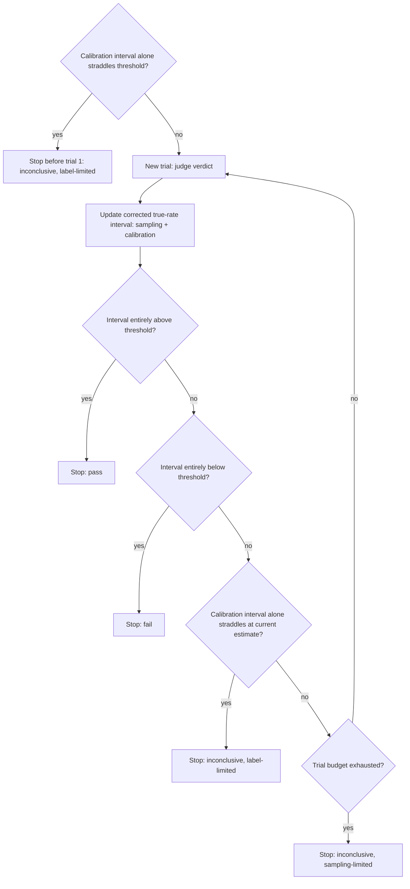
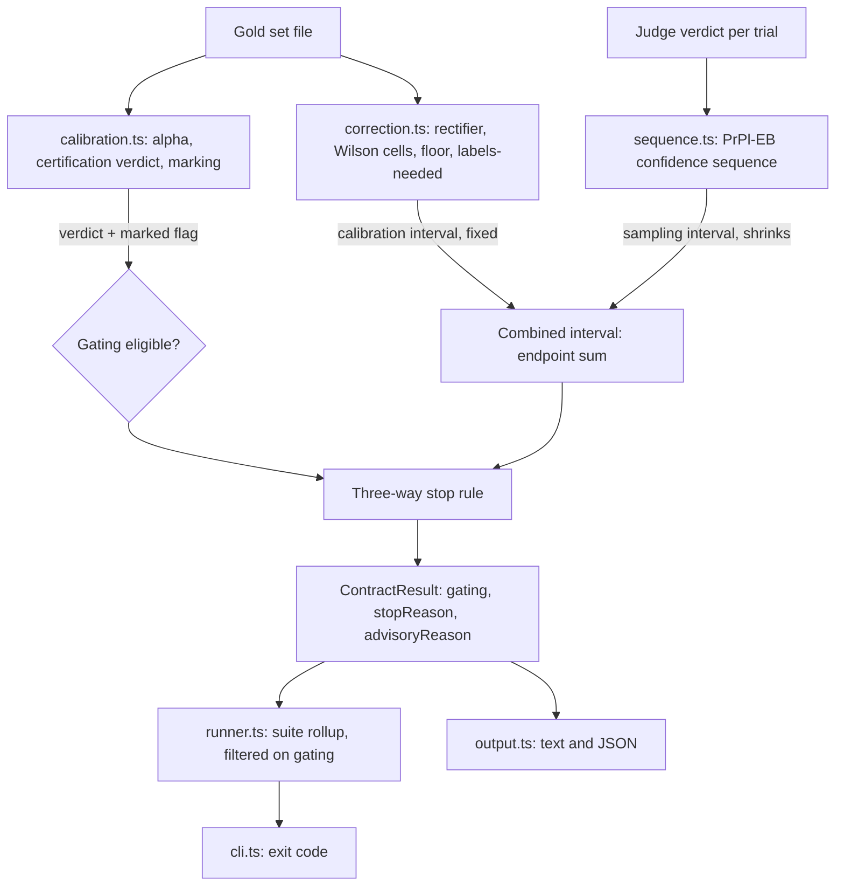
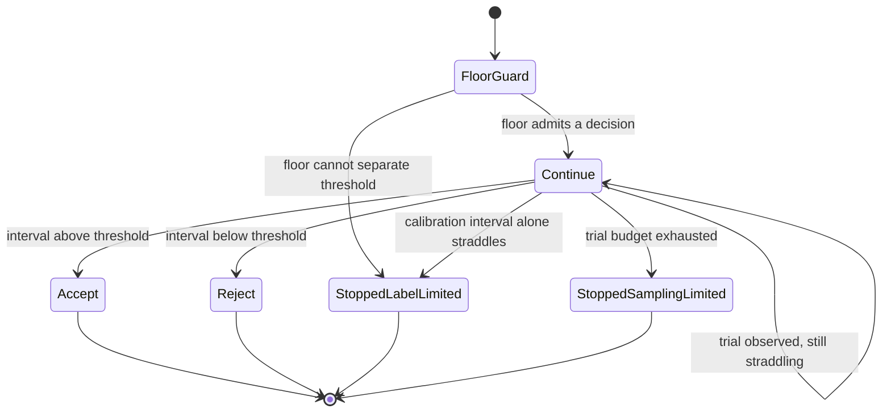
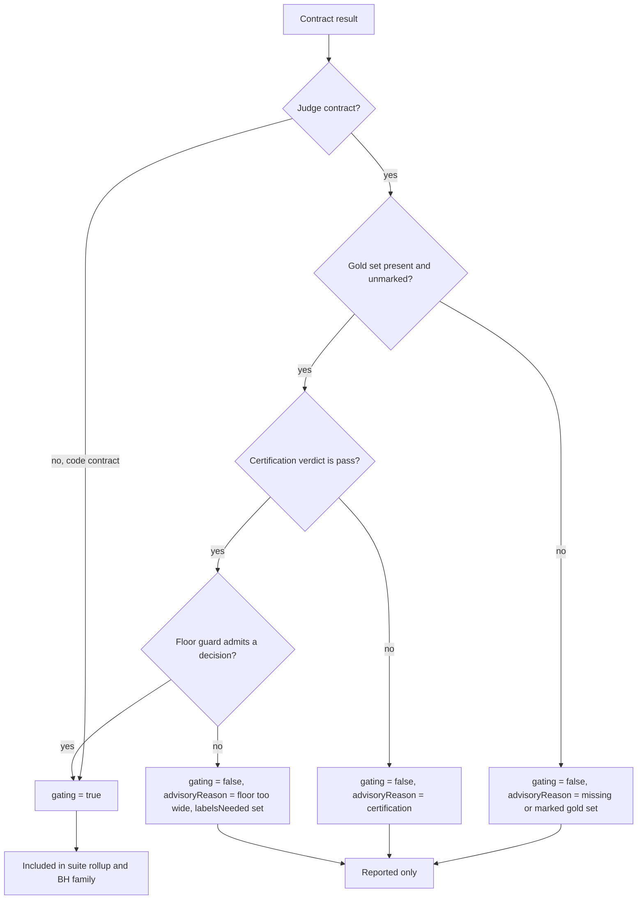

# Calibrated Judge Contracts for Cerberus - Plan

## Goal Capsule

- **Objective:** A Cerberus judge contract reports and gates on an honest estimate of the agent's *true* pass rate — corrected for the judge's own error and carrying the uncertainty of that correction — and only a judge certified against human labels can drive CI's exit.
- **Means:** Replace the judged-rate SPRT with a bias-corrected estimand tracked by an anytime-valid confidence sequence, and route every verdict through a gating-versus-advisory envelope (KTD1, KTD2, KTD3, KTD7).
- **Product authority:** This plan owns judge-contract calibration, correction, and gating in Cerberus. Code-assertion contracts and the KNOWN-specific machinery (taxonomy, regex backstop, the joint utility/safety gate) are not active scope.
- **Execution profile:** Statistics modules are built test-first against published reference values before any runner wiring. The envelope work (U7) changes exit-code behavior and must not regress existing suites.
- **Stop conditions:** Stop and report if the corrected estimand cannot be made to satisfy R5's two-term decomposition, or if the envelope cannot satisfy AE1 without changing code-contract behavior.
- **Tail ownership:** `ce-work` executes U1-U8 and runs the Verification Contract. This plan does not own release or rollout.

---

## Product Contract

**Product Contract preservation:** changed — R8, R9. Their stop-and-diagnosis predicate was re-expressed on the calibration interval alone, because the original wording stopped at roughly twice the calibration floor and so reported runs as label-limited that more trials would in fact have resolved. The intent is unchanged and now holds by construction: stop when more trials cannot help. Every other requirement keeps its meaning and ID. KD6 gained its session-settled annotation. Sources corrected: the `src/pcc/check.ts` precedent does not exist on this branch, the port source is the Apache-licensed OSS extraction, and `compare.py` is named as the deferred A/B reference rather than machinery being ported.

### Summary

Judge contracts in Cerberus gain a gold-label calibration path. With labels, a contract certifies the judge against humans, corrects its pass-rate estimate for judge error, and gates on the corrected quantity with an interval that reflects how many labels back it. Without labels, it reports the raw judged rate and runs advisory. The machinery is ported to TypeScript, self-contained in Cerberus.

Gold-set size decides what the feature can do, and the honest numbers are modest. The calibration floor's half-width is roughly 0.12 at 100 labels and 0.05 at 500, and a contract can only gate when its margin from the threshold exceeds that floor. So a typical contract — threshold 0.90, true rate near 0.95 — needs several hundred labels before it gates at all, and below that it reports label-limited and says how many more labels it would take. Label-limited is the expected outcome at small gold-set sizes, not an edge case, and R10 and R12 exist to make that visible in the first second rather than after a full budget of judge calls.

### Problem Frame

For a judge contract, Cerberus accumulates SPRT evidence on the LLM judge's pass/fail verdicts and reports a Wilson interval over that judged rate, treating the judge as ground truth. So the number it gates on is the rate at which the judge *says* pass, not the rate at which the agent *is* right, and the interval carries only sampling error — it looks precise even when the judge is biased or unmeasured. Code-assertion contracts are exact oracles and escape this; judge contracts do not. That gap is grounded in `src/stats.ts` and `src/runner.ts`, where the SPRT `success` stream and the Wilson inputs are the judge's own verdicts with no calibration path anywhere in the types or config.

### Key Decisions

- KD1. **Target Cerberus, not further KNOWN analysis.** (session-settled: user-directed — chosen over more KNOWN analysis: the engagement is concluded and its data cannot be shared.)
- KD2. **Lift certify-then-gate and build the correction.** The calibration and gating envelope is ported from the leakeval project; the bias-correction exists in neither repo and is new. (session-settled: user-directed — chosen over lifting either alone.) Governs R2, R3, R4, R5.
- KD3. **Gold labels are required to gate.** No labels means advisory only. (session-settled: user-directed — chosen over gating without labels: an uncalibrated judge has no authority.) Governs R6, R12.
- KD4. **The gate binds on the corrected estimand with a full-uncertainty, floor-aware stop.** (session-settled: user-directed — chosen over point-mapped correction: point-mapping keeps false precision and cannot diagnose a label-limited run.) Governs R4, R5, R7, R8, R9.
- KD5. **Port to TypeScript inside Cerberus.** (session-settled: user-directed — chosen over a shared package or a Python shell-out: keeps Cerberus a self-contained TS CLI.)
- KD6. **The correction is a rectifier, not a ratio, and weak judges are rejected twice.** The estimator is Prediction-Powered-Inference-shaped — the judged rate plus a gold-set bias term — so it has no `se + sp − 1` denominator to explode. A near-chance judge instead produces a high-variance rectifier and a wide calibration floor, which is the same decomposition R5 and R8 already depend on. Weak judges are refused twice over: α-certification refuses them up front (R6), and the floor guard refuses to gate when the calibration floor alone cannot separate the threshold (R10) — because α and the correction's stability are distinct statistics off the same small gold set, and passing one does not bound the other. (Rogan-Gladen is background, not the estimator: its ratio form is where the `se + sp → 1` blow-up comes from, and its point-mapped precision is what KD4 rejects.) (session-settled: user-approved — chosen over citing Rogan-Gladen and PPI interchangeably as "the correction": one estimator cannot both explode near chance and hold a fixed additive floor, so the plan had to pick the one R5 and R8 rest on.) Governs R3, R6, R10.

### Requirements

**Calibration**

- R1. A judge contract accepts a gold set: human labels over a subset of its scenarios, drawn to be representative of the scenario distribution the contract runs over. A gold set that is not a representative draw is accepted but marked, and a marked gold set cannot gate.
- R2. From the gold set, the contract estimates judge-vs-human agreement (Krippendorff α, with the judge added as an extra rater against the human matrix) and assigns a pre-committed verdict of pass, marginal, fail, or contestable.
- R3. From the gold set, the contract estimates the judge's error for use in correction: the bias rectifier and its uncertainty. Sensitivity and specificity are estimated alongside it and reported as certification diagnostics, not as the correction's divisor.

**Corrected estimand**

- R4. With a gold set, a judge contract's reported pass rate is the bias-corrected true-rate estimate. Without a gold set, it reports the judged rate, marked uncalibrated.
- R5. The corrected interval carries both sampling uncertainty from trials and calibration uncertainty from the gold set, so it never claims more precision than the labels support. It does not cover distributional mismatch between the gold set and the trial population; R1's representativeness condition is what bounds that, and the report says so.

**Gating authority**

- R6. A judge contract may gate — its verdict becomes eligible to drive the exit code through R11's envelope — only when it has an unmarked gold set and its certification verdict is `pass`. Any other verdict, including `marginal`, runs advisory: it reports, and it never drives a non-zero exit.
- R7. When it gates, the decision binds on the corrected true-rate estimand through a sequentially-valid test whose error control holds under per-trial monitoring.
- R8. The test stops three ways: decisively — pass when the corrected interval clears the threshold above, fail when below; inconclusive when the calibration interval alone would still straddle the threshold, so no number of further trials could decide it; or inconclusive when the trial budget is exhausted while a decision was still reachable. It terminates within the trial budget by construction.
- R9. An inconclusive result is diagnosed as label-limited (the calibration interval alone straddles — only more gold labels would resolve it) or sampling-limited (the budget ran out while a decision was still reachable — more trials would).
- R10. Before the first trial, the contract refuses to gate when the calibration floor alone cannot separate the threshold — no number of trials could produce a decisive result — and reports label-limited up front instead of running to exhaustion.

**Verdict envelope**

- R11. Verdicts flow through a gating-versus-advisory envelope: the verdict is derived from its gates, and whether a failing gate yields a non-zero exit is the caller's enforced choice. An advisory run still reports the verdict it would have had.
- R12. An advisory run reports why it is advisory and what would change that — no gold set, a non-`pass` certification, a marked gold set, or a floor too wide — and, where the reason is label count, an estimate of how many additional labels would let it gate.

### Key Flows

- F1. Per-run gate decision for a judge contract.
  - **Trigger:** A judge contract runs with an unmarked gold set and a `pass` certification.
  - **Steps:** The contract first checks the floor guard; if the calibration interval alone straddles the threshold it stops before trial 1. Otherwise each trial adds a judged verdict, the contract updates the corrected true-rate interval carrying both uncertainty sources, and after each trial it applies the stop rule.
  - **Outcome:** pass or fail when the interval clears the threshold on one side; inconclusive and label-limited when the calibration interval alone straddles the threshold at the current estimate; inconclusive and sampling-limited when the trial budget runs out while a decision was still reachable.
  - **Covers R7, R8, R9, R10.**

The floor guard and the label-limited stop are the same predicate evaluated at different times — before trial 1, and after each trial as the corrected estimate moves. That is what makes R9's diagnosis true by construction rather than a heuristic.

### Acceptance Examples

- AE1. **Covers R4, R6, R12.** **Given** a judge contract with no gold set, **when** it runs, **then** it reports the raw judged rate marked uncalibrated, stays advisory — exit 0 even when the rate is below threshold — and names the missing gold set as the reason it cannot gate.
- AE2. **Covers R6.** **Given** a gold set whose certification verdict is fail, **when** the contract runs, **then** it reports but does not gate, and a below-threshold result does not drive a non-zero exit.
- AE3. **Covers R7, R8.** **Given** a certified judge and a clear gap, **when** the corrected interval clears the threshold above at trial k, **then** the contract stops early and passes.
- AE4. **Covers R8, R9.** **Given** a certified judge and a gold set too small to separate the rate from the threshold, **when** the corrected estimate moves during the run to a point where the calibration interval alone straddles the threshold, **then** the contract stops inconclusive and reports label-limited.
- AE5. **Covers R6, R12.** **Given** a gold set whose certification verdict is `marginal`, **when** the contract runs, **then** it does not gate, and it reports that a `pass` certification is what it lacks.
- AE6. **Covers R8, R9.** **Given** a certified judge whose corrected interval still straddles the threshold while a decision remains reachable, **when** the trial budget is exhausted, **then** the contract stops inconclusive and reports sampling-limited, naming more trials as the resolution.
- AE7. **Covers R10, R12.** **Given** a certified judge whose calibration floor is by itself wider than the gap between the observed rate and the threshold, **when** the contract runs, **then** it refuses to gate before the first trial, reports label-limited, and estimates the additional labels it would need.

### Success Criteria

- A judge contract with no labels never drives a non-zero exit, and one whose certification verdict is anything but `pass` never gates.
- Adding trials past the calibration floor does not shrink a judge contract's reported interval below what the gold set supports.
- Every gated run terminates — decisive, label-limited, or sampling-limited at the trial budget — with no unbounded run, and a run that could never be decisive says so before spending trials.
- Every advisory run names the reason it is advisory, so no user has to infer why a contract will not gate.
- Ported statistics reproduce their canonical reference values (Krippendorff α, Wilson, and the rectifier correction) under test.

### Scope Boundaries

- KNOWN's 27-category taxonomy and the production regex backstop — not ported; Cerberus contracts are the general analog.
- The joint utility-and-safety (LR_h) gate — deferred; generalizing it needs a model of which contracts trade off against each other that Cerberus lacks.
- Bias-correction for code-assertion contracts — out; they are exact oracles.
- Judge-panel independence diagnostics for correlated majority-vote bias — out; a follow-on.
- A/B comparison of corrected rates between two runs — deferred; it serves no goal this plan states, and it is not a free extension of R5. Two arms calibrated against the same gold set are correlated through the shared rectifier, so a valid interval on the difference has to model that covariance rather than sum per-arm variances, and separately the calibration may not transfer at all when the generator changed materially between runs.
- A shared cross-language package or a Python runtime dependency — rejected.

#### Deferred to Follow-Up Work

- Bootstrap confidence interval for Krippendorff α (KTD5 reports α with a CI; the resampling implementation can land after U5 if it proves slow).
- Growing a gold set mid-run under a pre-committed ordering. Out of scope here because a fixed-`m` bound is what makes R5's floor valid; see KTD2.

### Outstanding Questions

- Deferred, with a default that ships: how loudly the upgrade announces that existing judge contracts have stopped gating. Every current config lacks a gold set, so R6 turns every judge contract advisory and a previously failing suite exits 0. R12's per-contract advisory reason is the specified mitigation and is what U8 ships. Escalating beyond it — a prominent one-time upgrade warning, or requiring an explicit acknowledgment before a judge contract may run advisory — would change product behavior and is not settled here. This does not block implementation; it is the first thing to revisit if the change lands badly.
- Deferred: whether α should remain part of the certification verdict at all. Research shows α is undefined when the gold set has zero disagreements and is high-variance below roughly 20 units, which is common for healthy binary suites. KTD5 keeps R6's verdict gate intact and makes the verdict robust, but dropping α from certification in favor of the rectifier interval alone is a live product option.
- Deferred to Planning-follow-up: the gold-label input schema beyond U4's minimum — richer per-scenario provenance, multi-annotator matrices, and label-scale negotiation.
- Deferred: how R1's representativeness condition is attested when a gold set is authored by hand rather than sampled from the trial stream. U4 records the mechanism; it does not verify it.

### Sources

- `src/stats.ts`, `src/runner.ts`, `src/types.ts` — current SPRT and Wilson over the judged stream; the estimand gap. `wilsonScoreInterval` and `inverseNormalCDF` already exist and are reused.
- `src/runner.ts` `runSuite` and `applyCorrection`, `src/cli.ts` exit-code mapping — the code that assumes every contract gates. There is no advisory precedent in this repo; R11's envelope is designed here, not ported.
- leakeval `leakeval/calibration.py`, `leakeval/metrics.py`, `leakeval/envelope.py` — the certify-then-gate machinery being ported, taken from the Apache-2.0 OSS extraction (KTD6). Its verdict-band rule is replaced rather than ported; see KTD5.
- leakeval `leakeval/compare.py` — the reference for the deferred A/B comparison. No unit ports it.
- Prediction-Powered Inference (Angelopoulos et al., 2023) — the correction itself: a rectified estimate whose precision floor is bounded by the calibration set, which is what R5, R8, and R9 rest on.
- Waudby-Smith and Ramdas (JRSS-B 2023) — the predictable-plug-in empirical-Bernstein confidence sequence adopted in KTD1.
- Rogan and Gladen (1978), prevalence estimation under an imperfect test — background only. Its ratio form is the classic `se + sp → 1` instability, and it is the point-mapped correction KD4 rejects; the sensitivity and specificity it takes as inputs survive here as R3's certification diagnostics.

---

## Planning Contract

### Key Technical Decisions

- KTD1. **Track the corrected estimand with a predictable-plug-in empirical-Bernstein confidence sequence, running-intersected.** The sampling term is a closed-form anytime-valid interval requiring six running scalars and no optimization. A truncated SPRT was rejected: Wald's boundaries are valid only untruncated, so recovering nominal error at a truncation point needs simulated critical values, and a two-point hypothesis test emits no interval, which is what R8's stop conditions are expressed on. The running intersection is required, not optional — the raw sequence width is not monotone, so without it the decisive stops oscillate and the run becomes non-deterministic across identical inputs. Instantiates KD4; governs R7, R8.
- KTD2. **Combine the sampling and calibration terms by a union bound with a pre-committed alpha split, summed on endpoints.** Total coverage is `1 - alpha_A - alpha_C`. The split is fixed in config before the run and never chosen after seeing which term dominates, which would turn the bound into a data-dependent selection. Default `alpha_C = 2*alpha/3`, `alpha_A = alpha/3`, because the calibration floor dominates at realistic gold-set sizes. Endpoints are summed rather than centers-plus-half-widths, because Wilson intervals are asymmetric. The union bound needs no independence between the terms, which is what makes a gold set drawn from the trial stream legitimate. Instantiates KD4; governs R5.
- KTD3. **Estimate the rectifier with lambda fixed at 1, and interval it as a union of two Wilson cells.** The rectifier is the judged rate plus `(a - b) / m`, where `a` counts judge false negatives and `b` judge false positives on the gold set. Its interval is `[L_a - U_b, U_a - L_b]` from two calls to the existing `wilsonScoreInterval`. A Wald interval on the rectifier was rejected: `a` or `b` is routinely zero for a good judge, and Wald then returns zero width for that cell — a coverage failure exactly when the gate says ship. Power-tuned lambda was rejected at this gold-set size: estimating lambda from the same labels carries `O(1/m)` bias and makes the variance estimate necessarily optimistic. R3's sensitivity and specificity are computed from the same two error cells and reported as the certification diagnostics; markedness is reported alongside them, as the one-line answer to how much a better judge would buy. Instantiates KD6; governs R3, R5.
- KTD4. **Give judge contracts their own sequential state type rather than extending `SPRTState`.** `SPRTState` and `updateSPRT` are immutable-by-contract, carry Wald boundaries, and have no vocabulary for a calibration floor or a three-way stop. Code contracts keep the existing SPRT path untouched, satisfying the scope boundary that exact oracles need no correction. The new state carries a third terminal decision so the runner's existing `decision !== "continue"` skip at `src/runner.ts` freezes a stopped judge contract through the same branch that already freezes a decided SPRT. Governs R7, R8, R9.
- KTD5. **Set the certification bands on judge-vs-human α directly, and report α as a diagnostic.** R6's verdict remains the gate. The pre-committed bands are Krippendorff's published cutoffs: `pass` at α ≥ 0.800, `marginal` at 0.667 ≤ α < 0.800, `fail` below 0.667, and `contestable` when α is undefined or the gold set is below the minimum unit count. Two degenerate cases are defined explicitly: a gold set with zero disagreements and perfect judge-human agreement yields `pass`, not `contestable`, because undefined α from perfect agreement is not evidence of a weak judge; a gold set below the minimum unit count yields `contestable`. α is reported with its interval as a diagnostic rather than compared as a bare point estimate. **The ported gap rule does not survive and is deliberately replaced.** leakeval scores a judge by the *gap* between judge-vs-human α and a human-human α baseline (`PASS_MARGIN`, `FAIL_MARGIN` in its `calibration.py`), which requires at least two human raters per unit. U4's gold set carries one label per scenario, so the human-human baseline is undefined and the ported rule would return insufficient-data for every gold set Cerberus can load. Absolute bands on judge-vs-human α are the single-annotator-compatible substitute, and `contestable` here means undefined-or-undersized rather than leakeval's low-human-agreement sense. **Conflict call-out against KD3 and R6:** research found α is undefined when expected disagreement is zero and high-variance below roughly 20 units, so α as the bare gate statistic would send healthy binary suites to advisory. This decision keeps R6's product rule and fixes the statistic; whether α belongs in certification at all is recorded as an Outstanding Question rather than resolved here, because narrowing R6 is a product change this plan has no authority to make. Governs R2, R6.
- KTD6. **Port the statistics from the Apache-2.0 leakeval OSS extraction, not the client engagement repo.** `calibration.py` is byte-identical between the two, and Cerberus is a public repository, so the OSS extraction is the citable provenance. (session-settled: user-approved — chosen over porting from the concluded client repo: identical code, and public-repo provenance should not trace to a concluded engagement.) Instantiates KD2.
- KTD7. **Make gating an explicit boolean on the contract result and filter the rollups on it.** `runSuite` currently derives suite status over every contract result, so an advisory judge contract reporting `fail` would flip the suite and exit non-zero, violating AE1. Advisory contracts are reported but excluded from the suite status rollup and from the multiple-comparison family, since a hypothesis that cannot gate should not spend alpha budget. A study or suite with zero gating contracts is vacuously passing. Governs R11, R12.
- KTD8. **Exclude judge `error` verdicts from the confidence sequence and the trial budget.** A judge API timeout is judge-availability noise, not judge-accuracy evidence, and folding it into the corrected rate contaminates the rectifier with a different error process than the gold set calibrated against. The existing per-study `max_error_rate` accounting is the precedent for giving errors their own path. Code contracts keep their current behavior, where an error counts as a failure. Governs R7.

### High-Level Technical Design

Three new flat modules join `src/`, one per statistical object, following how `src/stats.ts` already groups related statistical concerns in a single file. Nothing in the judge path reuses `updateSPRT`; nothing in the code path changes.

Contract decision states. The third terminal state is what the current `SPRTDecision` lacks.

Gating-versus-advisory envelope. This is the path with no existing precedent in the repo.

### Assumptions

- The alpha split defaults to `alpha_C = 2*alpha/3` and is exposed in config so a user can override it before a run.
- The label-limited predicate carries no free tolerance parameter. It is R10's floor-guard predicate re-evaluated after each trial, so the two cannot drift apart. It still requires a minimum of 50 observed trials before it can fire after trial 1, because the corrected point estimate moves early and a premature label-limited verdict is expensive to disbelieve.
- The gold set attaches as an optional path field on the judge contract schema, resolved against `configDir` like `study.scenario`, not against the working directory.
- Degenerate gold sets — missing content, malformed, empty, or below the minimum unit count — are marked and run advisory rather than raising a config error. A configured gold-set path that does not resolve to a file at all is a config error, matching the existing judges-array precedent.
- Trials are assumed independent and identically distributed. Shared sandbox state, warm caches, or an agent that learns within a run break the confidence sequence guarantee with no numerical symptom, so the assumption is documented at the module boundary.

### System-Wide Impact

- **Every existing judge contract becomes advisory on upgrade.** No config in the wild has a gold set, so R6 makes every judge contract today gating-ineligible. A suite that fails CI today on a judge contract will exit 0 after this change. This is the intended consequence of KD3, but it converts a red build to a green one silently, which is the most dangerous direction for a change to move. U8's advisory reason makes it visible in the report; whether that is loud enough is an Open Question below.
- **The exit code is an external contract.** `cli.ts` maps suite status to an exit code consumed by CI. U7 changes what feeds that mapping. The pre-existing e2e exit-code assertions are the regression guard, and none of them may change.
- **The JSON result shape is an external contract.** `writeJsonOutput` destructures fields explicitly, and `persistResult` writes run records under `.cerberus/runs/`. U8 adds fields; it must not rename or remove existing ones, or stored run history stops parsing.
- **Multiple-comparison correction changes for existing suites.** Excluding advisory contracts from the family shrinks `n`, which loosens the corrected alpha for the remaining gating contracts. A mixed suite's code contracts therefore see a different corrected alpha than before, even though no code-contract logic changed.
- **Judge API cost.** The floor guard (R10) and the label-limited stop (R8) both exist partly to stop spending judge calls on a run that cannot conclude. U8's pre-run floor disclosure is the cheapest form of this saving.

### Sequencing

U1, U2, U3, and U4 are independent and can land in any order. U5 needs U1, U2, and U4. U6 needs U2, U3, and U5. U7 needs U6. U8 needs U7. The three statistics modules are built and tested against published reference values before any runner wiring, so a numerical defect cannot be mistaken for an integration defect.

---

## Implementation Units

### U1. Krippendorff alpha port

- **Goal:** Port the agreement statistic to TypeScript with published reference values pinned.
- **Requirements:** R2. Instantiates KTD6.
- **Dependencies:** none.
- **Files:** `src/calibration.ts`, `tests/calibration.test.ts`.
- **Approach:**
  1. Port the coincidence-matrix construction and the nominal, interval, and ordinal difference functions from the leakeval reference.
  2. Sort the observed value set numerically. A default JavaScript sort is lexicographic and silently corrupts the ordinal and interval rankings while leaving nominal alpha correct.
  3. Return an explicit undefined-agreement result when expected disagreement is zero or fewer than two pairable values exist, rather than a number.
  4. Report valid units, not total columns — single-rater units are skipped and must not inflate the reported sample size.
- **Execution note:** Build this test-first against the published vectors below; the reference values are the specification.
- **Patterns to follow:** `src/stats.ts` section-divider comments and the `_inverseNormalCDF` underscore-prefixed test-export convention. `readonly` on every returned shape.
- **Test scenarios:**
  - Canonical 3-rater by 15-unit matrix returns nominal alpha 0.691 and interval alpha 0.811, matching the published worked example.
  - The same matrix's intermediate coincidence matrix matches the published values, isolating a matrix bug from a difference-function bug.
  - A published 4-rater by 12-unit matrix returns nominal alpha 0.743, with 41 non-missing values, 11 valid units, and 40 pairable values asserted separately.
  - On any binary matrix, nominal, ordinal, and interval alpha are equal, because the ordinal difference is constant on a two-valued scale.
  - An all-same-value matrix returns undefined agreement, not 1.0.
  - A matrix whose only entries are two single-rater units returns undefined agreement.
  - A ragged matrix throws.
  - Negative alpha is returned unclamped.
- **Verification:** `npm test -- calibration` passes and every published value matches to its stated precision.

### U2. Rectifier, calibration interval, and floor

- **Goal:** Produce the fixed calibration term, the floor, and the labels-needed estimate.
- **Requirements:** R3, R5, R10. Instantiates KTD3.
- **Dependencies:** none.
- **Files:** `src/correction.ts`, `tests/correction.test.ts`.
- **Approach:**
  1. Count judge false negatives `a` and false positives `b` over the gold set; the point estimate is the raw `(a - b) / m`, never a Wilson center.
  2. Build the calibration interval as `[L_a - U_b, U_a - L_b]` from two `wilsonScoreInterval` calls. That function takes a two-sided confidence and derives `z` internally, so a per-cell level of `alpha_C / 2` is passed as `confidence = 1 - alpha_C / 2`.
  3. Expose the floor half-width, and a solver that inverts it to the gold-set size needed to reach a target half-width, for R12's labels-needed figure.
  4. Compute sensitivity and specificity from the same two error cells and return them as R3's certification diagnostics. Return markedness alongside them.
- **Patterns to follow:** `src/stats.ts` `wilsonScoreInterval` return shape.
- **Test scenarios:**
  - A gold set with zero false negatives still returns a non-degenerate interval, where a Wald interval would return zero width for that cell.
  - A gold set with zero disagreements of either kind returns an interval containing zero with non-zero width.
  - The floor half-width decreases monotonically as `m` grows at a fixed error rate, and is near 0.12 at `m = 100` for a judge with roughly 5 percent error in each direction.
  - The labels-needed solver round-trips: solving for a target half-width and recomputing the floor at that `m` reproduces the target within tolerance.
  - A perfectly asymmetric judge — all errors in one direction — produces an interval that excludes zero.
  - Sensitivity and specificity are returned and match hand-computed values for a known confusion matrix.
  - `m = 0` is rejected rather than producing a division result.
- **Verification:** `npm test -- correction` passes, including the `m = 100` floor magnitude assertion.

### U3. Predictable-plug-in confidence sequence

- **Goal:** Provide the anytime-valid sampling term.
- **Requirements:** R7. Instantiates KTD1.
- **Dependencies:** none.
- **Files:** `src/sequence.ts`, `tests/sequence.test.ts`.
- **Approach:**
  1. Maintain the six running scalars and update in constant time per trial.
  2. Compute the per-trial increment as a single fused term; do not materialize the variance-proxy and the psi function separately, which reintroduces a subtraction between two near-equal constants.
  3. Use a series expansion for the psi term below a small lambda threshold, and `Math.log1p` rather than `Math.log(1 - x)` above it.
  4. Derive the tuning parameter only from trials strictly before the current one, and assert it stays within its open bounds — a NaN passes through a minimum silently and then poisons every downstream sum.
  5. Return the running intersection of all intervals seen so far, not the raw current interval.
- **Execution note:** The predictability property has no observable symptom when violated, so write the perturbation test before the implementation.
- **Patterns to follow:** the immutability discipline of `updateSPRT` in `src/stats.ts` — a state update returns a new state and never mutates.
- **Test scenarios:**
  - The interval contains the true mean at every step across a long simulated stream at a known rate.
  - The tuning parameter at trial `t` is unchanged when the observation at trial `t` is perturbed, proving it depends only on earlier trials.
  - The returned interval width is non-increasing across trials, because of the running intersection.
  - The psi term matches a high-precision reference at a very small lambda, where the naive difference form loses significant digits.
  - A stream of all-identical observations does not produce NaN or a zero-width interval at small `t`.
  - State at `t = 0` comes from the regularizers rather than a special-cased first trial.
- **Verification:** `npm test -- sequence` passes, including the coverage simulation and the perturbation test.

### U4. Gold-set schema, loading, and provenance marking

- **Goal:** Let a judge contract reference a gold set, and mark one that cannot support gating.
- **Requirements:** R1. Instantiates KD3.
- **Dependencies:** none.
- **Files:** `src/config.ts`, `src/types.ts`, `tests/config.test.ts`, `tests/fixtures/gold-sets/`, `tests/fixtures/gold-set-config.yaml`.
- **Approach:**
  1. Add an optional gold-set path and an optional alpha-split override to the judge contract schema. Both are absent by default, so every existing config keeps parsing.
  2. Resolve the path against `configDir`, matching how `study.scenario` resolves.
  3. Load labels and record the sampling mechanism as declared provenance. A gold set whose provenance is not declared is marked.
  4. Mark, rather than throw, for malformed, empty, or undersized content. Reserve the config-error exit for a path that does not resolve to a file, following the existing post-parse validation pattern for the judges array.
- **Patterns to follow:** the post-`safeParse` validation block in `src/config.ts` that requires a judges array when a judge contract exists.
- **Test scenarios:**
  - A config with no gold set parses unchanged and yields no gold set.
  - A gold-set path resolves relative to the config file's directory, not the working directory.
  - A gold-set path pointing at a missing file is a config error with the config-error exit code.
  - Malformed gold-set content is marked, not thrown, and carries a reason string.
  - An empty gold set is marked with a distinct reason from a malformed one.
  - A gold set below the minimum unit count is marked.
  - A gold set with no declared provenance is marked.
- **Verification:** `npm test -- config` passes and every pre-existing config fixture still loads.

### U5. Certification verdict and floor guard

- **Goal:** Decide whether a judge is eligible to gate, before any trial runs.
- **Requirements:** R2, R6, R10. Instantiates KTD5.
- **Dependencies:** U1, U2, U4.
- **Files:** `src/calibration.ts`, `src/types.ts`, `tests/calibration.test.ts`.
- **Approach:**
  1. Derive the verdict from gold-set disagreement counts, with alpha and its interval attached as diagnostics.
  2. Map the zero-disagreement, perfect-agreement case to `pass`. Map a below-minimum-units gold set to `contestable`.
  3. Evaluate the floor guard against the contract threshold and return the labels-needed figure when the floor cannot separate it.
  4. Surface the gold-set size and implied floor for display before the trial loop starts.
- **Patterns to follow:** U1's undefined-agreement return shape; `readonly` result types as in `src/types.ts`.
- **Test scenarios:**
  - Covers AE7. A judge whose floor exceeds the threshold gap is refused before trial 1, with a labels-needed figure attached.
  - Covers AE5. A `marginal` verdict yields gating-ineligible with a certification reason.
  - Covers AE2. A `fail` verdict yields gating-ineligible.
  - A gold set below the minimum unit count yields `contestable`, exercising the fourth verdict.
  - Each band boundary is exercised at its edge: α just above 0.800 yields `pass`, just below yields `marginal`, and just below 0.667 yields `fail`.
  - A gold set with zero disagreements and perfect agreement yields `pass`, not `contestable`.
  - A marked gold set yields gating-ineligible regardless of its verdict.
  - The reported floor matches U2's floor for the same gold set.
- **Verification:** `npm test -- calibration` passes, including all four verdict values and the guard.

### U6. Calibrated judge evaluation in the runner

- **Goal:** Replace the judged-rate SPRT with the corrected estimand for gold-set judge contracts.
- **Requirements:** R4, R7, R8, R9. Realizes F1 end to end. Instantiates KTD1, KTD2, KTD4, KTD8.
- **Dependencies:** U2, U3, U5.
- **Files:** `src/runner.ts`, `src/types.ts`, `src/output.ts`, `tests/runner.test.ts`, `tests/fixtures/gold-set-config.yaml`, `tests/fixtures/scripted-judge.ts`.
- **Approach:**
  1. Establish a deterministic offline judge before anything else in this unit. Every provider in `src/judges.ts` throws when its API key is unset, and `runStudy` calls `evaluateContract` directly with no injection seam, so no AE-citing test can run in CI without one. Add a scripted-verdict judge that replays a fixed sequence, reached either by mocking the judges module in tests or by registering a scripted provider, plus a judge-contract fixture that references a gold set. U7 reuses both.
  2. Add a calibrated state type carrying the confidence-sequence state, the fixed calibration interval, and a decision with a third terminal value plus a stop reason.
  3. At the judge-verdict seam, route gold-set judge contracts to the calibrated update and leave code contracts and uncalibrated judge contracts on the existing SPRT path.
  4. Combine the sampling and calibration intervals by summing endpoints, then clamp to the unit interval last.
  5. Apply the three-way stop after each trial, and route the new terminal decision through the loop's existing skip branch so a stopped contract consumes no further judge calls.
  6. Skip `error` verdicts: they advance neither the sequence nor the contract's trial count.
  7. Add the stop-reason field to the contract result here, not in U7, because this unit's own AE4 and AE6 tests must tell label-limited from sampling-limited and both otherwise collapse to `inconclusive`. U7 adds only the gating, advisory-reason, and labels-needed fields.
  8. Update the progress display, whose contract-state type requires the SPRT state a calibrated contract no longer has. Leaving it out breaks or silently degrades progress output for exactly the contracts this unit introduces.
- **Execution note:** Build the scripted judge first — every other test scenario in this unit and in U7 depends on it. Then add a characterization test over the existing SPRT path before touching the seam, so a regression in code-contract behavior is caught immediately.
- **Patterns to follow:** the existing per-contract state map and the `decision !== "continue"` skip in `runStudy`.
- **Test scenarios:**
  - Every scenario below runs against the scripted judge with no API key set, proving the offline path works.
  - Covers AE3. A certified judge with a clear gap stops early and passes before the trial budget.
  - Covers AE4. A certified judge whose corrected estimate drifts to where the calibration interval alone straddles the threshold stops label-limited.
  - Covers AE6. A certified judge for which a decision was still reachable at budget exhaustion stops sampling-limited.
  - The floor guard and the label-limited stop agree: a contract the guard would refuse before trial 1 is never admitted and then stopped sampling-limited instead.
  - Covers AE1. A judge contract with no gold set reports the raw judged rate and is marked uncalibrated.
  - A stopped judge contract makes no further judge calls while a sibling contract continues to a higher trial count.
  - Judge `error` verdicts advance neither the sequence nor the trial count, and a run consisting only of errors terminates without a decision.
  - A code contract in the same study produces byte-identical results to the pre-change behavior.
  - The corrected rate differs from the judged rate for a biased judge, in the direction the gold set implies.
  - The progress display renders a calibrated contract without error, proving the contract-state type change landed.
- **Verification:** `npm test -- runner` passes and the pre-existing runner suite is unchanged.

### U7. Gating-versus-advisory envelope

- **Goal:** Let a contract report without driving the exit code.
- **Requirements:** R11, R12. Instantiates KTD7.
- **Dependencies:** U6.
- **Files:** `src/types.ts`, `src/runner.ts`, `src/cli.ts`, `tests/runner.test.ts`, `tests/e2e.test.ts`. Reuses U6's scripted judge and gold-set fixture; the AE1 e2e case runs with no API key.
- **Approach:**
  1. Add gating, advisory-reason, and labels-needed fields to the contract result. U6 already added the stop reason.
  2. Filter the suite status rollup to gating contracts only, so an advisory failure cannot flip the suite.
  3. Apply the same filter before the multiple-comparison family is sized, so advisory contracts consume no alpha budget and receive no corrected alpha.
  4. Treat a study or suite with zero gating contracts as passing, with one exception below.
  5. Force suite status to fail for an aborted study, regardless of the gating filter. A study aborts when the agent exceeds the error-rate ceiling, and today that signal reaches suite status only through a per-contract failure — which step 2 now filters out. Without this, a crashed agent whose contracts are all advisory exits 0. Agent availability is not judge calibration and must keep its own channel.
  6. Leave the exit-code mapping reading the suite status, which is now computed from gating contracts alone plus the abort rule.
- **Execution note:** This unit changes exit-code behavior. Prove AE1 end-to-end before refactoring anything else here.
- **Patterns to follow:** the existing suite-status rollup and correction application in `runSuite`.
- **Test scenarios:**
  - Covers AE1. A suite whose only judge contract is advisory and below threshold exits 0.
  - A study mixing a failing gating code contract and a failing advisory judge contract exits 1, and the advisory contract is named in the report but not in the cause.
  - A suite with zero gating contracts exits 0.
  - A study that aborts on the error-rate ceiling exits non-zero even when every one of its contracts is advisory, so a crashed agent never produces a green run.
  - Advisory contracts are absent from the multiple-comparison family, and the gating contracts' corrected alpha matches what it would be with the advisory contracts removed from the config entirely.
  - An advisory contract still reports the verdict it would have had.
  - Every pre-existing e2e exit-code expectation is unchanged.
- **Verification:** `npm test -- e2e` passes and no existing exit-code assertion changed.

### U8. Reporting the new state space

- **Goal:** Make the stop reason, the advisory reason, and the labels-needed figure visible.
- **Requirements:** R9, R12. Instantiates KTD7.
- **Dependencies:** U7.
- **Files:** `src/output.ts`, `tests/output.test.ts`.
- **Approach:**
  1. Extend the text formatter to name the stop reason and to mark advisory contracts distinctly from failing ones.
  2. Add the new fields to the JSON output, which destructures every field explicitly today and will silently drop anything not added.
  3. Print the gold-set size and implied floor before the trial loop begins, so a user learns an unresolvable threshold in the first second rather than after a full budget of judge calls.
  4. For a label-limited stop, state the gold-set size that would resolve it.
  5. Print one prominent warning to stderr, separate from the per-contract report body, the first time a run contains a judge contract that is advisory only because it has no gold set. A team that reads the exit code or greps CI logs for a pass/fail line would otherwise see nothing, and this is the case where a previously red build silently goes green.
- **Patterns to follow:** the existing status-badge switch and the explicit JSON field list in `src/output.ts`.
- **Test scenarios:**
  - A label-limited result renders its stop reason and its labels-needed figure in text output.
  - A sampling-limited result renders distinctly from a label-limited one.
  - An advisory contract renders distinctly from a failing gating contract.
  - The JSON output contains gating, advisory reason, stop reason, and labels-needed for a calibrated contract.
  - The JSON output for an uncalibrated contract is unchanged from today's shape apart from the gating flag.
  - The pre-run floor disclosure prints before any trial output.
  - A run containing a judge contract that is advisory for lack of a gold set prints the stderr warning exactly once, and a run with no such contract prints none.
- **Verification:** `npm test -- output` passes and a manual `npm run dev` against the gold-set fixture shows the floor line first.

---

## Verification Contract

| Gate | Command | Applies to | Signal |
|---|---|---|---|
| Type check | `npm run typecheck` | all units | No errors; no `any` introduced |
| Unit tests | `npm test` | all units | Full suite green, including pre-existing tests |
| Statistics reference values | `npm test -- calibration correction sequence` | U1, U2, U3 | Published vectors match to stated precision |
| Exit-code behavior | `npm test -- e2e` | U7 | AE1 exits 0; no pre-existing exit-code assertion changed |
| Build | `npm run build` | all units | tsup build succeeds |
| Manual smoke | `npm run dev -- run <gold-set fixture config>` | U8 | Floor disclosure prints before trials; stop reason named at the end |

Quality gates that hold across every unit: no new runtime dependency, `readonly` on new interface fields, `node:` prefix on built-in imports, and no `any` in source.

---

## Definition of Done

Global:

- Every requirement R1-R12 is either implemented by a unit or explicitly deferred in Scope Boundaries.
- Every acceptance example AE1-AE7 has a test that cites it.
- The full test suite, type check, and build pass.
- No new runtime dependency appears in `package.json`.
- Code-contract behavior is unchanged, proven by the pre-existing runner and e2e suites.
- Abandoned experimental code from approaches that did not work is removed, not left in the diff.
- The independence assumption and the certification-versus-correction gold-set reuse are documented at the module boundary, since neither is visible from the code.

Per unit:

| Unit | Done when |
|---|---|
| U1 | Published alpha vectors and the coincidence matrix match; degenerate cases return undefined agreement |
| U2 | Zero-count cells produce non-degenerate intervals; floor magnitude and labels-needed round-trip hold |
| U3 | Coverage simulation holds; the tuning parameter is provably predictable; widths are non-increasing |
| U4 | Existing configs parse unchanged; each degenerate gold set is marked with a distinct reason |
| U5 | All four verdict values reachable; the floor guard refuses before trial 1 with a labels-needed figure |
| U6 | All three stops reachable and diagnosed; error verdicts excluded; code contracts unchanged; every test runs with no API key |
| U7 | AE1 exits 0; advisory contracts excluded from rollup and correction family; an aborted study still exits non-zero |
| U8 | Stop and advisory reasons render in text and JSON; floor discloses before trials |
